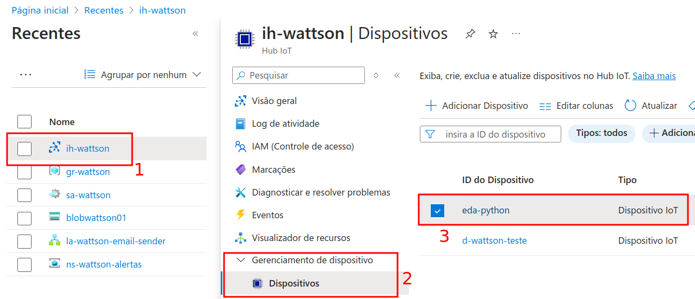
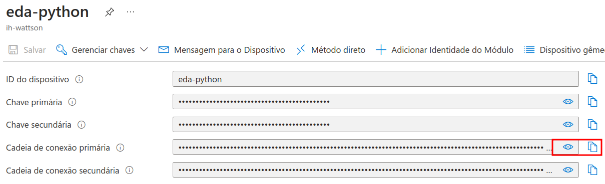

# EDA Azure - WattsOn
Solução de simulação de dados de sensores IoT, integrada com a Azure para uso dos dados no ambiente de nuvem.

## Ferramentas utilizadas
- Azure
- Python
- Numpy
- asyncio
- .env
- venv

## Passo a passo
### 1. Clone o projeto
```
git clone https://github.com/WattsonSptech/Sensores.git
cd ./Sensores
```
### 2. Instale as dependências
Opcional: criação de ambiente virtual
Para enviar conflitos com as dependências já instaladas, crie um ambiente virtual (venv) com o seguinte comando:
```
python -m venv .venv
```
---
Usando o pip, execute 
```
pip install -r requirements.txt
```
### 2. Crie um arquivo .env
Copie o arquivo ``.env.template`` como "``.env``".
### 3. Preencha a connection string
Na Azure, acesse a aba de dispositivos do seu IoTHub. Selecione um dispositivo existente o crie um novo.

Em seguinda, clique no nome dele e copie o valor do campo "cadeia de conexão primária".

Cole ele no parâmetro XPTO do .env recém criado.
### 4. Execute
Execute o arquivo main.py. 
```
python3 main.py
```
Para alterar a quantidade de dados de cada sensor, altere o valor fixado do parâmetro ``quantidade``, no método ``obter_dados``.